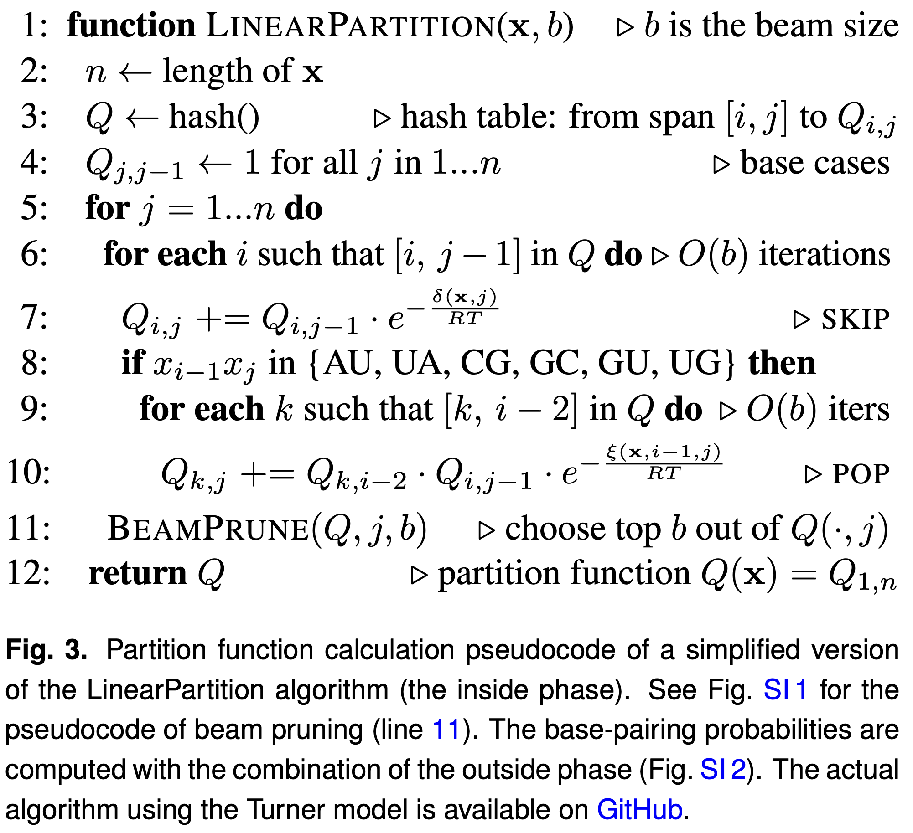

# LinearPartition Paper

This is the LaTeX source for the [arXiv version](https://arxiv.org/abs/1912.13190) of the LinearPartition paper.

The published version is [here](https://academic.oup.com/bioinformatics/article/36/Supplement_1/i258/5870487), but the arXiv version is much preferred because 

- it contains the Appendix in the same PDF (so  the main text has clickable hyperrefs to figures/tables in the Appendix).
- it was typeset by LaTeX instead of the publisher's Word-like system.

The pseudocode for the partition function (inside) is in [`tex/fig_pseudocode.tex`](tex/fig_pseudocode.tex):

# PNAS LaTeX template

The old 2018 PNAS template used to produce this paper in 2020 is no longer compatible with the latest LaTeX, so this repo switched to the 2019 PNAS template (from the LinearTurboFold paper).
